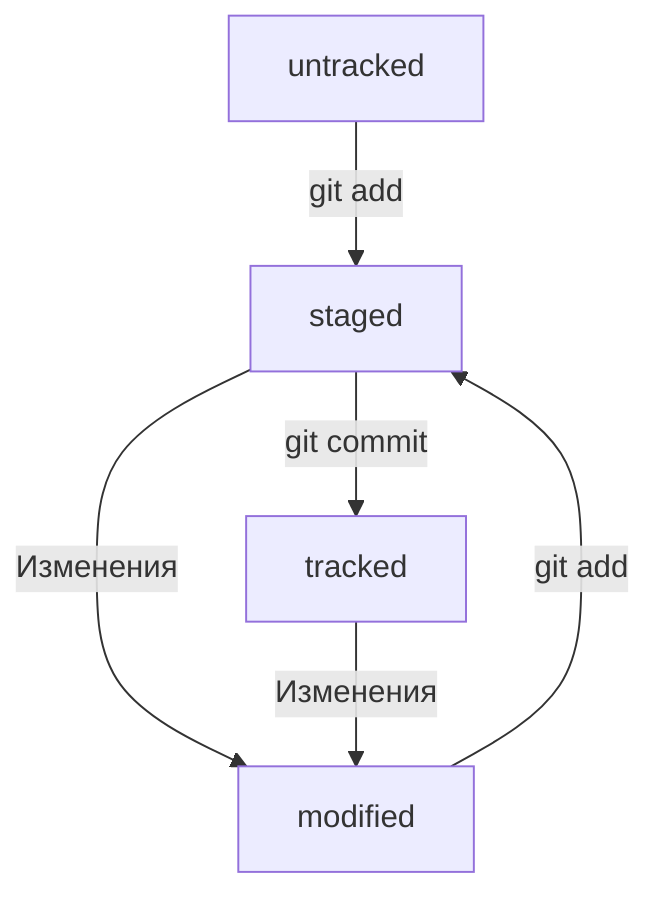

# Глава 1: Введение
Команды для Git
pwd - выводит путь к рабочей директории
cd (change directory) - сменить рабочую папку
```
$ cd ~
```
Сменить рабочую папку на домашнюю

## Тема 1: Навигация в командной строке
**ls - вывести содержимое директории**
**cd - сменить директорию**
Она меняет текущую рабочую директорию на ту, которая указана в качестве параметра: `cd имя_папки`
Чтобы вернуться в **родительскую директорию** — то есть на уровень выше, — вместо названия папки нужно написать две точки: `..`
Также `cd` позволяет перемещаться сразу через несколько директорий. Для этого нужно разделить их названия знаком `/`.
```
$ pwd
/projects # сейчас мы здесь

$ cd github/open-source-project # переходим через несколько директорий

$ pwd
/projects/github/open-source-project # переместились сразу в папку open-source-project внутри github
```

### Дополнительные возможности ls
Но можно вызвать `ls` с флагом `-a` и вывести расширенный список. В нём отобразятся все скрытые файлы, которые начинаются с символа `.` (например, файлы конфигурации). В том числе два особых файла `.` и `..`, которые обозначают текущую и родительскую директории.

А ещё, как и другие команды, `ls` может работать с символом домашней директории (`~`) и предыдущей директории (`..`). Например, `ls ~` выведет содержимое домашней директории вне зависимости от того, что показывает `pwd`. А `ls ..` покажет содержимое родительской директории.

## Тема 2: Операции с папками и файлами: создание, копирование, перемещение
### Создание файлов и директорий — `touch`, `mkdir`

Чтобы создать файл, нужно ввести в консоль команду `touch` (англ. «коснуться») с именем файла в качестве параметра: `touch %ИМЯ_ФАЙЛА%`.
```
touch my-new-file.txt # создали файл my-new-file.txt
```
Для создания директорий через терминал используют другую команду — `mkdir` (от англ. _**m**a**k**e **dir**ectory_ — «создать директорию»).
```
$ mkdir new-dir # создали директорию new-dir
```
Можно создать целую структуру директорий одной командой с помощью флага `-p`.
```
$ mkdir -p dir1/dir-inside/dir-deeper-inside
# создали папку dir-deeper-inside в папке dir-inside, которая находится в папке dir1
```

### Копирование файлов — `cp`

Для копирования файлов через терминал существует команда `cp` (от англ. _**c**o**p**y_ — «копировать»). В простом виде `cp` принимает два параметра: `что копируем` и `куда копируем`.
```
$ cp что_копируем куда_копируем

$ cp index.html src/
# скопировали index.html в папку src
```
### Перемещение файлов и папок — `mv`

Копирование создаёт копию файла или папки. Но иногда вместо копии нужно удалить файл в одном месте и создать в другом. Для этого есть команда `mv` (от англ. _**m**o**v**e_ — «переместить»).
После имени команды указывают список файлов и папок, которые нужно переместить, а затем — папку, в которую нужно выполнить перемещение.

## Тема 3: Операции с папками и файлами: чтение и удаление
### Чтение файлов — `cat`
Чтобы прочитать файл, в консоль нужно ввести `cat` (от англ. c_on**cat**enate and print_ — «объединить и распечатать») вместе с именем файла. Команда распечатает то, что содержится в нём.
```
$ cat myfile.txt # распечатали содержимое файла myfile.txt
file-content-1
file-content-2
```

### Удаление файлов и папок — `rm`, `rmdir`, `rm -r`
Чтобы удалить файл, нужно напечатать команду `rm` (от англ. _**r**e**m**ove —_ «удалить») и передать ей имя файла.
Удалить папку можно командой `rmdir` (от англ. _**r**e**m**ove **dir**ectory —_ «удалить директорию»). Не забудьте указать имя папки.
Если в папке, которую вы пытаетесь стереть, есть какие-то файлы, то командная строка не удалит её и выведет сообщение о том, что папка не пуста (англ. `Directory not empty`).

Если папку нужно удалить, используется команда `rm -r`, которая рекурсивно удаляется каждый файл изнутри. В итоге, команда удалит пустую директорию.

## Лайфхаки
### Выполняйте сразу несколько команд
Команды в терминале необязательно вбивать и выполнять по очереди. Их можно указывать не по одной, а сразу списком. Для этого их нужно разделить двумя амперсандами (`&&`).
```
$ mkdir second-project && cd second-project && touch index.html style.css
# создаём папку second-project,
# переходим в папку second-project
# и создаём в ней два файла: index.html и style.css
```
### Вызывайте команды из буфера
В командной строке есть буфер, по которому можно перемещаться, управляя стрелками вверх или вниз.
### Используйте автозаполнение
Необязательно заучивать все команды наизусть. Если нужно найти какую-нибудь из них, достаточно вспомнить, с каких букв она начинается. Можно набрать их в командной строке и дважды нажать клавишу `Tab`. Терминал покажет список всех команд, которые начинаются с этих символов.
### Применяйте команды для быстрой навигации
Напомним основные:

- `pwd` — проверить, где мы находимся;
- `ls` — посмотреть список файлов/папок в директории;
- `cd` — перейти в выбранную папку.

С помощью этих команд можно быстро перемещаться между каталогами и изучать их содержимое.
А ещё можно почти мгновенно перемещаться в ключевые папки. Допустим, вы хотите увидеть содержимое **корневой директории** (англ. _root directory_). Это верхняя в иерархии папка, в которой хранится всё, что есть на вашем жёстком диске. Дальнейшие действия зависят от типа операционной системы. Чтобы сделать это на macOS или Linux, напечатайте в командной строке слеш (`/`) и дважды нажмите `Tab`.

Чтобы попасть в корневую директорию Windows, нужно перейти на соответствующий диск.
```
$ cd c:/ # переместились в корневую директорию
$ ls
Documents and Settings/     Windows/
Program Files/              Users/
Program Files (x86)/

# содержимое корневой директории Windows
```


## Настройка Git
### Работа с файлом настройки `.gitconfig`

C помощью команды `git config` (от англ. _configuration —_ «конфигурация», «настройка») с ключом `--global` (англ. «глобальный»). При этом не имеет значения, в какой директории вы находитесь прямо сейчас: вызов `git config --global` сработает везде.
```
$ git config --global user.name "User Namovich" 
# имя или ник нужно написать латиницей и в кавычках

$ git config --global user.email username@yandex.ru
# здесь нужно указать свой настоящий email
```
Все глобальные настройки Git хранит в файле `.gitconfig` в домашней директории. Команда запишет в этот файл указанные имя и почту. Чтобы убедиться в этом, можно вызвать команду для чтения файлов.
```
$ cat ~/.gitconfig
```
Другой способ проверки — вывести содержимое файла конфигурации Git той же командой `git config` с флагом `--list` (англ. «список»).
```
$ git config --list
```


## Шпаргалка
### Навигация

- `pwd` (от англ. _**p**rint **w**orking **d**irectory_, «показать рабочую папку») — покажи, в какой я папке;
- `ls` (от англ. _**l**i**s**t directory contents_, «отобразить содержимое директории») — покажи файлы и папки в текущей папке;
- `ls -a` — покажи также скрытые файлы и папки, названия которых начинаются с символа `.`;
- `cd first-project` (от англ. _**c**hange **d**irectory_, «сменить директорию») — перейди в папку `first-project`;
- `cd first-project/html` — перейди в папку `html`, которая находится в папке `first-project`;
- `cd ..` — перейди на уровень выше, в родительскую папку;
- `cd ~` — перейди в домашнюю директорию (`/Users/Username`);
- `cd /` — перейди в корневую директорию.

### Работа с файлами и папками

**Создание**

- `touch index.html` (англ. _touch,_ «коснуться») — создай файл `index.html` в текущей папке;
- `touch index.html style.css script.js` — если нужно создать сразу несколько файлов, можно напечатать их имена в одну строку через пробел;
- `mkdir second-project` (от англ. _**m**a**k**e **dir**ectory_, «создать директорию») — создай папку с именем `second-project` в текущей папке.

**Копирование и перемещение**

- `cp file.txt ~/my-dir` (от англ. _**c**o**p**y_, «копировать») — скопируй файл в другое место;
- `mv file.txt ~/my-dir` (от англ. _**m**o**v**e_, «переместить») — перемести файл или папку в другое место.

**Чтение**

- `cat file.txt` (от англ. _con**cat**enate and print_, «объединить и распечатать») — распечатай содержимое текстового файла `file.txt`.

**Удаление**

- `rm about.html` (от англ. _**r**e**m**ove_, «удалить») — удали файл `about.html`;
- `rmdir images` (от англ. _**r**e**m**ove **dir**ectory_, «удалить директорию») — удали папку `images`;
- `rm -r second-project` (от англ. _**r**e**m**ove,_ «удалить» + _**r**ecursive_, «рекурсивный») — удали папку `second-project` и всё, что она содержит.

### Полезные возможности

- Команды необязательно печатать и выполнять по очереди. Можно указать их списком — разделить двумя амперсандами (`&&`).
- У консоли есть собственная память — буфер с несколькими последними командами. По ним можно перемещаться с помощью клавиш со стрелками вверх (**`↑`**) и вниз (**`↓`**).
- Чтобы не вводить название файла или папки полностью, можно набрать первые символы имени и дважды нажать `Tab`. Если файл или папка есть в текущей директории, командная строка допишет путь сама.
    
    Например, вы находитесь в папке `dev`. Начните вводить `cd first` и дважды нажмите `Tab`. Если папка `first-project` есть внутри `dev`, командная строка автоматически подставит её имя. Останется только нажать `Enter`.


# Глава 2: Коммит
## Тема 1: Инициализируем репозиторий
### Сделать папку репозиторием — `git init`

Чтобы Git начал отслеживать изменения в проекте, папку с файлами этого проекта нужно сделать **Git-репозиторием** (от англ. _repository_ — «хранилище»). Для этого следует переместиться в неё и ввести команду `git init` (от англ. _**init**ialize_ — «инициализировать»).

```
$ cd ~/dev/first-project # перешли в нужную папку

$ git init # создали репозиторий
```
### «Разгитить» папку, если что-то пошло не так, — `rm -rf .git`

Если вы случайно сделали Git-репозиторием не ту папку, её можно «разгитить». Для этого нужно удалить скрытую подпапку `.git`.
```
$ cd <папка с репозиторием> # перешли в папку

$ rm -rf .git # удалили подпапку .git
```
- ключ `-r` (от англ. _**r**ecursive_ — «рекурсивно») позволяет удалять папки вместе с их содержимым;
- ключ `-f` (от англ. _**f**orce_ — «заставить») избавит вас от вопросов вроде «Вы точно хотите удалить этот файл? А этот? И этот тоже?».
### Проверить состояние репозитория — `git status`

После инициализации репозитория `first-project` запустите команду `git status` (от англ. _status_ — «статус», «состояние») — она показывает текущее состояние репозитория.

## Добавляем файлы в репозиторий
### Подготовить файлы к сохранению — `git add`

Добавим в репозиторий два файла. Например, файл `todo.txt`, в котором будет список дел, и `readme.txt` для информации о проекте.

Состояние `untracked` значит, что Git ещё не хранит информацию о версиях файла и не может отследить, как он изменялся.
```
$ git add --all # подготовили к сохранению все файлы в репозитории
$ git status # проверили статус
```
Файлы можно добавлять и по одному без ключа. Или можно добавить текущую папку целиком - в этом случае все файлы в ней тоже будут добавлены. Обратиться к текущей папке в Bash позволяет точка (`.`).
```
$ git add . # добавить всю текущую папку
$ git status
```

add - подготовка файла к сохранению, commit - сохранение изменений в файле.
Если сейчас отредактировать любой из «зелёных» файлов в папке `first-project`, он перейдёт в состояние `modified` (англ. «изменённый») и будет и в «зелёном», и в «красном» списках.

### Выполнить коммит — `git commit`

Сделать коммит можно командой `git commit` c ключом `-m` (от англ. _**m**essage_ — «сообщение»), который присваивает коммиту сообщение.

Обычно в таком сообщении поясняется, в чём именно состояли изменения. Это как заметки на полях: благодаря им проще читать и понимать текст. Сообщение коммита выполняет те же функции — улучшает понимание и упрощает навигацию. Оно пишется после ключа `-m` в кавычках.

Команда `git commit` выведет информацию о коммите.

- `[master (root-commit) baa3b6e]` значит:
    - коммит был в ветке `master`;
    - `root-commit` — это самый первый, или «корневой» (англ. _root_), коммит в ветке, у следующих коммитов такой надписи не будет;
    - `baa3b6e` — сокращённый идентификатор коммита (подробнее об этом мы ещё расскажем).
- `2 files changed, 1 insertion(+)` значит:
    - изменились два файла (`readme.txt` и `todo.txt`);
    - одна строка была добавлена (`1. Пройти пару уроков по Git.`).
- Строки вида `create mode 100644 readme.txt` — это более подробная информация о новых (добавленных в Git) файлах.
    - `create` (англ. «создать») говорит, что файл был создан. Если бы файл был удалён, на этом месте было бы слово `delete` (англ. «удалить»).
    - `mode 100644` сообщает, что это обычный файл. Также возможны варианты `100755` для исполняемых файлов (например, `что-нибудь.exe`) и `120000` для файлов-ссылок в Linux. Файлы-ссылки не содержат данных сами по себе, а только ссылаются на другие файлы — как «ярлыки» в Windows.
    -
### Просмотр историю коммитов
### Просмотреть историю коммитов — `git log`
# Синхронизация репозиториев
## Связывание локального и удаленного репозиториев
### Привязать удалённый репозиторий к локальному — `git remote add`
```
$ cd ~/dev/first-project
$ git remote add origin git@github.com:%ИМЯ_АККАУНТА%/first-project.git
```
### Убедиться, что репозитории связаны, — `git remote -v`
```
$ git remote -v
origin    git@github.com:%ИМЯ_АККАУНТА%/%ИМЯ-ПРОЕКТА%.git (fetch)
origin    git@github.com:%ИМЯ_АККАУНТА%/%ИМЯ-ПРОЕКТА%.git (push)
```
## Синхронизация локального и удалённого репозитория
### Отправить изменения на удалённый репозиторий — `git push`
Вы уже прошли весь «цикл коммита»: подготовили файлы с помощью `git add`, закоммитили их с комментарием командой `git commit -m`. Осталось загрузить содержимое локального репозитория на GitHub. За это отвечает команда `git push` (от англ. _push_ — «толкать»).

В первый раз эту команду нужно вызвать с флагом `-u` и параметрами `origin` (имя удалённого репозитория) и `main` или `master` (название текущей ветки). Флаг `-u` свяжет локальную ветку с одноимённой удалённой. Как вы связывали локальный и удалённый репозитории в предыдущем уроке, так же и здесь нужно дополнительно связать ветки.
```
$ git push -u origin main # Если команда приведёт к ошибке, попробуйте 
                          # заменить main на master.
```

# Файл README.md и как его оформлять
### Подробнее о том, зачем нужен **`README.md`**

Как правило, в `README.md` проекта можно найти следующую информацию:

1. Название проекта и его краткое описание: кем создан, для чего, какие решает задачи и какие закрывает проблемы.
2. Технологии, которые применяются в проекте. В чём его отличие от аналогичных.
3. Документация проекта — подробная инструкция о том, что представляет собой проект.
4. Планы проекта, если они есть.
## Как создать и оформить `README.md`

`README.md` — текстовый файл, который можно создать командой `touch`, а затем редактировать так же, как и любой другой текстовый документ. Например, в блокноте.
### Заголовки, абзацы и перенос

- **Заголовки** разных уровней создают решётками.
```
# H1 — заголовок первого уровня, самый большой
## H2 — заголовок второго уровня, поменьше
### H3
#### H4
##### H5
###### H6 — заголовок шестого уровня, самый маленький
```
- Можно добавить **черту под заголовком или абзацем**.
```
#### Заголовок 4

Текст над чертой

---

Текст под чертой
```
- Чтобы сделать **разрыв строки**, нужно поставить два пробела (в примере ниже они обозначены точками `⋅⋅`) или сочетание символов `<br>`.
```
Текст до переноса⋅⋅  
Текст после переноса <br>
Текст после второго переноса
```
- Чтобы начать **новый параграф**, в конце предыдущей строки должно стоять два символа переноса. Для этого нужно нажать `Enter` два раза.
```
line

another line 
```
- Если сделать один перенос строки, как в примере ниже, и не поставить два пробела, текст сольётся в одну строку.
```
line 
another line
```
### Выделение текста

- Чтобы выделить текст **курсивом** (`*текст*`), его заключают в звёздочки (астериски) или нижние подчёркивания.

```
Курсив — это *звёздочки* или _подчёркивания_. 
```

- Чтобы выделить текст **полужирным шрифтом** (`**текст**`), его окружают двойными звёздочками или двойными нижними подчёркиваниями.

```
Полужирный шрифт — двойные **звёздочки** или двойные __подчёркивания__.
Можно совместить выделение **звёздочки и _подчёркивания_**. 
```

- Чтобы **зачеркнуть текст** (`~~текст~~`), его окружают двойными волнистыми линиями — тильдами.

```
~~Зачёркнутый текст.~~ 
```

### Списки

- Для оформления **нумерованного списка** достаточно поставить в начало строки цифры с точкой.

```
1. Первый пункт нумерованного списка.
2. Второй пункт. 
```

- **Ненумерованный список** создаётся звёздочкой с пробелом в начале строки либо дефисом с пробелом.

```
* первый пункт ненумерованного списка;
* второй пункт ненумерованного списка

- первый пункт ненумерованного списка;
- второй пункт ненумерованного списка 
```

### **Ссылки**

- Чтобы сделать ссылкой часть текста, его заключают в квадратные скобки, а затем указывают нужный адрес в круглых скобках.

```
[Яндекс](https://www.yandex.ru) 
```

- Также можно добавить ссылке **тайтл** (от англ _title_ — «название», «заголовок»). Тайтл — это всплывающая подсказка, которая появляется при наведении мыши на ссылку. Тайтл нужно заключить в кавычки и указать внутри скобок после адреса.

```
[Яндекс](https://www.yandex.ru "Я Yandex!") 
```

### **Код**

Чтобы оформить текст как код, нужно окружить его тройками косых кавычек — грависов. После первой тройки грависов указывают язык программирования, на котором написан код. В маркдауне есть поддержка синтаксиса почти всех популярных языков и инструментов.

````
```bash
ls - la
```
```html
<h1>А я просто текст</h1>
``` 
````

Обратите внимание: вторая тройка тройных кавычек стоит на отдельной строке.

# Хэш - идентификатор коммита
### Что такое хеш. Хеширование коммитов

**Хеширование** (от англ. _hash_, «рубить», «крошить», «мешанина») — это способ преобразовать набор данных и получить их «отпечаток» (англ. _fingerprint_).

Информация о коммите — это набор данных: когда был сделан коммит, содержимое файлов в репозитории на момент коммита и ссылка на предыдущий, или **родительский** (англ. _parent_), коммит.

Git хеширует (преобразует) информацию о коммите с помощью алгоритма **SHA-1** (от англ. _**S**ecure **H**ash **A**lgorithm_ — «безопасный алгоритм хеширования») и получает для каждого коммита свой уникальный **хеш** — результат хеширования.

Свойства хэш:
- если хеш получить дважды для одного и того же набора входных данных, то результат будет гарантированно одинаковый;
- если хоть что-то в исходных данных поменяется (хотя бы один символ), то хеш тоже изменится (причём сильно).

Итоги:
- Git преобразует информацию о коммитах с помощью алгоритма SHA-1 и для каждого из них рассчитывает уникальный идентификатор — хеш.
- Хеш — основной идентификатор коммита и позволяет узнать его автора, дату и содержимое закоммиченных файлов.
- Все хеши, а также таблицу соответствий `хеш → информация о коммите` Git хранит в папке `.git`.


# **Лог**
### Элементы описания коммита

После вызова `git log` появляется список коммитов.
Разберём элементы, из которых состоит описание:

- строка из цифр и латинских букв после слова **commit** — это хеш коммита;
- **Author** — имя автора и его электронная почта;
- **Date** — дата и время создания коммита;
- в конце находится сообщение коммита.
### Получить сокращённый лог — `git log --oneline`

Получить сокращённый лог можно с помощью команды `git log` с флагом `--oneline` (англ. «одной строкой»). В терминале появятся только первые несколько символов хеша каждого коммита и их комментарии.

💡 Обратите внимание: если выход из просмотра логов не произошёл автоматически, нажмите клавишу `Q` (от англ. _**Q**uit —_ «выйти») в английской раскладке клавиатуры.

# **Head**
### Файл `HEAD`

Файл `HEAD` (англ. «голова», «головной») — один из служебных файлов папки `.git`. Он указывает на коммит, который сделан последним (то есть на самый новый).
```
$ pwd # посмотрели, где мы
/Users/user/dev/first-project

$ cd .git/
$ ls # посмотрели, какие есть файлы
COMMIT_EDITMSG  ORIG_HEAD  description  index  logs/     refs/
HEAD            config     hooks/       info/  objects/

$ cat HEAD # команда cat показывает содержимое файла
ref: refs/heads/master # в файле вот такая ссылка
```
Внутри `HEAD` — ссылка на служебный файл: `refs/heads/master` (или `refs/heads/main` в зависимости от названия ветки). Если заглянуть в этот файл, можно увидеть хеш последнего коммита.
```
$ cat refs/heads/master # взяли ссылку из файла HEAD
# внутри хеш
e007f5035f113f9abca78fe2149c593959da5eb7

$ git log 
# сверяем с хешем последнего коммита
commit e007f5035f113f9abca78fe2149c593959da5eb7
Author: John Doe <johndoe@example.com>
Date:   Tue Mar 28 00:26:53 2023 +0300

    Добавить амбиций в список дел

... # другие коммиты
```

# **Статусы файлов в Git**
### Статусы `untracked`/`tracked`, `staged` и `modified`

Одна из ключевых задач Git — отслеживать изменения файлов в репозитории. Для этого каждый файл помечается каким-либо статусом. Рассмотрим основные.

- **`untracked`** (англ. «неотслеживаемый»)  
    Мы говорили, что новые файлы в Git-репозитории помечаются как `untracked`, то есть неотслеживаемые. Git «видит», что такой файл существует, но не следит за изменениями в нём. У `untracked`-файла нет предыдущих версий, зафиксированных в коммитах или через команду `git add`.
- **`staged`** (англ. «подготовленный»)
    
    После выполнения команды `git add` файл попадает в **staging area** (от англ. _stage_ — «сцена», «этап [процесса]» и _area_ — «область»), то есть в список файлов, которые войдут в коммит. В этот момент файл находится в состоянии `staged`.
    
    В одном из предыдущих уроков мы сравнили коммит с фотографией. Можно развить эту аналогию и сказать, что команда `git add` добавляет персонажей (текущее содержимое файла или нескольких файлов) на **сцену** (англ. _stage_) для общей фотографии, а `git commit` делает снимок всей сцены целиком.

> [!💡 **Staging area, index и cache**]
> 
> Staging area также называют **index** (англ. «каталог») или **cache** (англ. «кеш»), а состояние файла `staged` иногда называют `indexed` или `cached`.
> 
> Все три варианта могут встречаться в документации и в качестве флагов команд Git.]

- **`tracked`** (англ. «отслеживаемый»)  
    Состояние `tracked` — это противоположность `untracked`. Оно довольно широкое по смыслу: в него попадают файлы, которые уже были зафиксированы с помощью `git commit`, а также файлы, которые были добавлены в staging area командой `git add`. То есть все файлы, в которых Git так или иначе отслеживает изменения.
- **`modified`** (англ. «изменённый»)  
    Состояние `modified` означает, что Git сравнил содержимое файла с последней сохранённой версией и нашёл отличия. Например, файл был закоммичен и после этого изменён.

### Типичный жизненный цикл файла в Git

Может показаться, что файлы в репозитории попадают в разные состояния хаотично. На практике это не так, и у большинства файлов вполне предсказуемый путь.


1. Файл только что создали. Git ещё не отслеживает содержимое этого файла. Состояние: `untracked`.
2. Файл добавили в staging area с помощью `git add`. Состояние: `staged` (+ `tracked`).
    - Возможно, изменили файл ещё раз. Состояния: `staged`, `modified` (+ `tracked`). Обратите внимание: `staged` и `modified` у одного файла, но у разных его версий.
    - Ещё раз выполнили `git add`. Состояние: `staged` (+ `tracked`).
3. Сделали коммит с помощью `git commit`. Состояние: `tracked`.
4. Изменили файл. Состояние: `modified` (+ `tracked`).
5. Снова добавили в staging area с помощью `git add`. Состояния: `staged` (+ `tracked`).
6. Сделали коммит. Состояния: `tracked`.
7. Повторили пункты 4−74−7 много-много раз.

# **Как читать git status**
### Какие состояния показывает `git status`

Большинство файлов в типичном проекте будут находиться в состоянии `tracked` (то есть закоммичены и не изменены после коммита). Вы не увидите это состояние в выводе команды `git status` — иначе она бы каждый раз выводила список вообще всех файлов проекта.

В итоге `git status` показывает только следующие состояния файлов:

- `staged` (`Changes to be committed` в выводе `git status`);
- `modified` (`Changes not staged for commit`);
- `untracked` (`Untracked files`).

### Подготавливаем репозиторий

Чтобы попрактиковаться, инициализируйте новый репозиторий `~/dev/git-status-lesson`. Создайте в нём файл `README.md` и закоммитьте его.
```
$ cd ~/dev
$ mkdir git-status-lesson
$ cd git-status-lesson
$ git init
# тут Git выведет что-нибудь, но мы это пропустим
$ touch README.md
$ git add README.md
$ git commit -m 'Добавить README'
~~~~# по традиции первым создадим и закоммитим файл README.md
```
### Типичные варианты вывода `git status`

Рассмотрим четыре примера состояний, в которых может находиться ваш репозиторий.

1. **Нет ни `staged`-, ни `modified`-, ни `untracked`-файлов.**

Если ничего не менять в `git-status-lesson` после первого коммита, то в нём не должно быть ни изменённых файлов (`modified`), ни новых (`untracked`), ни добавленных в список на коммит (`staged`). Вызовите команду `git status`. Её вывод будет примерно таким.
```
$ git status
On branch master
nothing to commit, working tree clean 
```
Это означает, что в репозитории нет новых или изменённых файлов. Последняя строка `nothing to commit, working tree clean` буквально переводится как «нечего коммитить, рабочая директория чиста».

Первая строка `On branch master` сообщает, что текущая ветка — `master`.

2. **Найдены неотслеживаемые файлы.**

Создайте в папке `~/dev/git-status-lesson` файл `fileA.txt`. Теперь в репозитории есть новый файл в состоянии `untracked`. Снова вызовите команду `git status`. Результат будет таким.
```
$ touch fileA.txt
$ git status
On branch master
Untracked files: # найдены неотслеживаемые файлы
  (use "git add <file>..." to include in what will be committed)
        fileA.txt

nothing added to commit but untracked files present (use "git add" to track)
```
3. **Найдены изменения, которые не войдут в коммит**

Теперь откройте файл `fileA.txt` и добавьте в него несколько слов — например, `Это файл A!`. Сохраните `fileA.txt` и вызовите команду `git status`. Её результат будет такой.3. **Найдены изменения, которые не войдут в коммит**

Теперь откройте файл `fileA.txt` и добавьте в него несколько слов — например, `Это файл A!`. Сохраните `fileA.txt` и вызовите команду `git status`. Её результат будет такой.

4. **Файл добавлен в staging area, но после этого изменён**

Вы добавили файл в staging area, но перед самым коммитом вспомнили важную мелочь. Например, вместо одного восклицательного знака в конце строки `Это файл A!` нужно поставить три.

Откройте текстовый редактор и добавьте нужные правки. Теперь можно выполнить коммит, но в любой непонятной ситуации сначала стоит вызвать `git status`. Он покажет следующее.
```
# изменили fileA.txt
$ git status
On branch master
Changes to be committed:
  (use "git restore --staged <file>..." to unstage)
          modified:   fileA.txt

Changes not staged for commit:
  (use "git add <file>..." to update what will be committed)
  (use "git restore <file>..." to discard changes in working directory)
          modified:   fileA.txt
```





